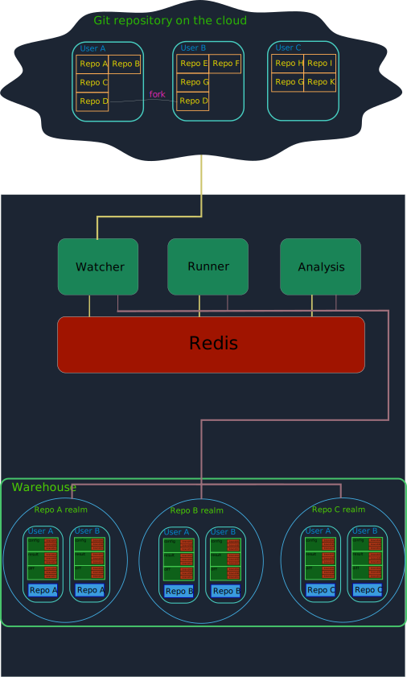

# 孟夏 (草案)


（这已经是三代了 、二代目前正在 运行、持续迁移中、一代由于太过超前、各方面条件不具备、挂起了、等待被通知就绪）

## 简介

名称 ： 孟夏

名称由来 : 因为是四月开始的 、所以叫 孟夏

目的 : 自动化测试平台

简述 :   
1. 基于 git 管理的仓库的 测试平台 

2. 不依赖于某个git平台，只需提供仓库的url、即可加入测试队列、进行测试 、

3. 测试结果与分析 会通过邮件的方式 反馈给使用者、可获得同类别项目的性能均值比较、

4. 在每次更新后的仓库 都会 重新运行 测试 、持续跟进结果 


## 项目结构 (未全、持续补充)

[初始版]


[第二次修改版]


[第三次修改版]


## 前提 准备

默认OS Ubuntu 20.04

需要 git git-lfs

需要 redis
```
sudo apt install redis-server

(redis client 可以选择 Redis Desktop Manager)
```
python3 lib

```
pip3 install requests
pip3 install schedule
pip3 install PyYAML
pip3 install redis
```

### 运行 zcore 所需要的 配置

需要 rust 

需要 musl

```
sudo apt install musl-tools musl-dev
```

可选 kvm

```
sudo apt install qemu-kvm libvirt-daemon-system libvirt-clients bridge-utils
```

## 获取

```
git clone https://github.com/GCYYfun/MengXia
```

## 开始


```
cd MengXia

python3 watcher.py (temp)

```

开箱即用 一键运行

## 说明

* 我们把项目的根目录简称 根目录

1. 在根目录 下 config 文件 配置 了 仓库需要观测 仓库的列表 repo_list.yaml 、在其中添加 仓库 地址
1. 已经clone的仓库 放在 already_clone.yaml 文件里、 自动添加、
1. 根目录 的 warehouse 是 各种仓库聚集地、


## 目前进度

watcher 模块 已完成

预计 还有 runner 模块、 analysis 模块、 statistics 模块 、 feedback 模块 

（暂定）


| moudle     | status |
|------------|--------|
| watcher    | ok     |
| runner     | ok     |
| analysis   |        |
| statistics |        |
| feedback   |        |


## 模块流程图 （draft）
### Watcher module
```
观测 模块、负责拉取和更新repo
```


### Runner module
```
运行 模块、负责执行更新后的测试
```

### Dispatcher module
```
分发 模块、负责针对不同平台数据的分发和环境的建立
```

### Analysis module
```
分析 模块、负责对结果的整理分析 、形成报告文件文件
```
